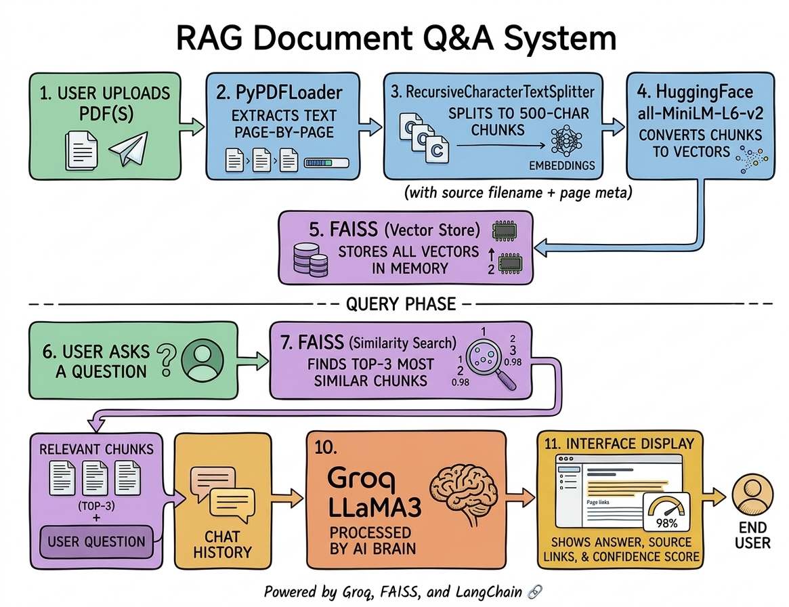

# 📚 DocMind — RAG Document Q&A System

A production-quality RAG (Retrieval-Augmented Generation) system
that lets you upload multiple PDFs and have a conversation with them.

---

## ✨ Features

| Feature | What it does |
|---------|-------------|
| **Multi-PDF Support** | Upload and query across multiple documents at once |
| **Conversational Memory** | Remembers last 5 Q&A turns for follow-up questions |
| **Source Highlighting** | Shows exactly which page and paragraph each answer came from |
| **Confidence Score** | Displays FAISS similarity score as answer confidence % |

---

## 🏗️ How It Works



---

## 🛠️ Tech Stack

| Layer | Tool |
|-------|------|
| Language | Python 3.10+ |
| Orchestration | LangChain |
| LLM | Groq API (LLaMA3-8B) |
| Embeddings | HuggingFace sentence-transformers/all-MiniLM-L6-v2 |
| Vector DB | FAISS (local, no cloud)|
| Memory | LangChain ConversationBufferWindowMemory |
| UI | Streamlit |
| Package Manager | UV |

---

## 🚀 Setup

### 1. Get a free Groq API key
→ https://console.groq.com — Sign up and create an API key

### 2. Install UV
```bash
curl -LsSf https://astral.sh/uv/install.sh | sh
```

### 3. Clone and setup
```bash
git clone https://github.com/yourusername/rag-document-qa.git
cd rag-document-qa

uv venv
source .venv/bin/activate
uv sync
```

### 4. Add API key
```bash
cp .env.example .env
# Open .env and add: GROQ_API_KEY=your_key_here
```

### 5. Run
```bash
streamlit run app.py
```

---

## 🌐 Deploy Free on Streamlit Cloud

1. Push this repo to GitHub
2. Go to https://streamlit.io/cloud
3. Connect your GitHub repo
4. Add `GROQ_API_KEY` in Secrets settings
5. Deploy → Get a public shareable URL