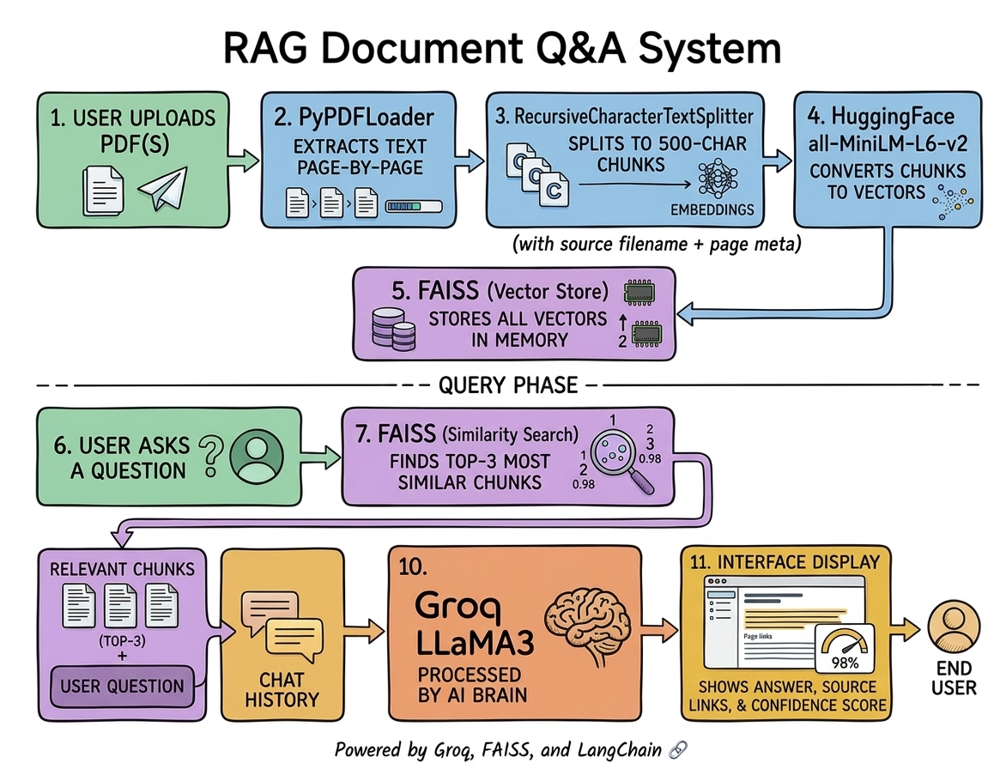

# 📚 DocMind — RAG Document Q&A System

DocMind is a multi-document RAG system that lets users upload PDFs and get precise, grounded answers instantly, instead of manually searching through hundreds of pages.

---

## ✨ Features

| Feature | What it does |
|---|---|
| **Multi-PDF Support** | Upload and query across multiple documents simultaneously with cross-document retrieval |
| **Hybrid Search (FAISS MMR + BM25)** | Combines semantic vector search and keyword search (60/40) for superior retrieval accuracy |
| **Cross-Encoder Re-ranking** | Re-scores top 10 candidates by reading question + chunk together — same approach as Cohere Rerank |
| **Conversational Memory** | Remembers last 5 Q&A turns for context-aware follow-up questions |
| **Source Highlighting** | Shows exact filename, page number, and keyword-highlighted paragraph each answer came from |
| **Confidence Score** | Displays FAISS cosine similarity as answer confidence % per query |
| **Rerank Score** | Shows cross-encoder relevance score alongside confidence for dual-layer quality signal |
| **Chat History Persistence** | Saves all conversations as JSON sessions with timestamps — survives browser refresh |
| **Smart Question Suggestions** | Auto-generates 4 relevant questions from document content after upload |
| **Anti-repetition Prompt** | Engineered prompt with temperature=0.5 eliminates generic closing statements |
| **RAGAS Evaluation Tab** | On-demand system quality scoring — faithfulness, answer relevancy, context precision, context recall |

---

## 💡 Problems it is designed to solve:
- Enterprises with messy scattered internal docs — policies, manuals, reports — need one searchable knowledge base
- Regulated industries like finance and legal need auditable, source-cited AI outputs
- Companies that can't share sensitive data with public LLMs — everything runs locally with open-source models
- Organisations whose data changes frequently — RAG always answers from the latest uploaded documents, not stale training data

---

## 🏗️ How It Works



---

## 🛠️ Tech Stack

| Layer | Tool |
|-------|------|
| Language | Python 3.10+ |
| Orchestration | LangChain |
| LLM | Groq API (LLaMA3-8B) |
| Embeddings | HuggingFace sentence-transformers/all-MiniLM-L6-v2 |
| Vector DB | FAISS (local, no cloud)|
| Memory | LangChain ConversationBufferWindowMemory |
| UI | Streamlit |
| Package Manager | UV |

---

## 🚀 Setup

### 1. Get a free Groq API key
→ https://console.groq.com — Sign up and create an API key

### 2. Install UV
```bash
curl -LsSf https://astral.sh/uv/install.sh | sh
```

### 3. Clone and setup
```bash
git clone https://github.com/yourusername/rag-document-qa.git
cd rag-document-qa

uv venv
source .venv/bin/activate
uv sync
```

### 4. Add API key
```bash
cp .env.example .env
# Open .env and add: GROQ_API_KEY=your_key_here
```

### 5. Run
```bash
streamlit run app.py
```

---

## 🌐 Deploy Free on Streamlit Cloud

1. Push this repo to GitHub
2. Go to https://streamlit.io/cloud
3. Connect your GitHub repo
4. Add `GROQ_API_KEY` in Secrets settings
5. Deploy → Get a public shareable URL
